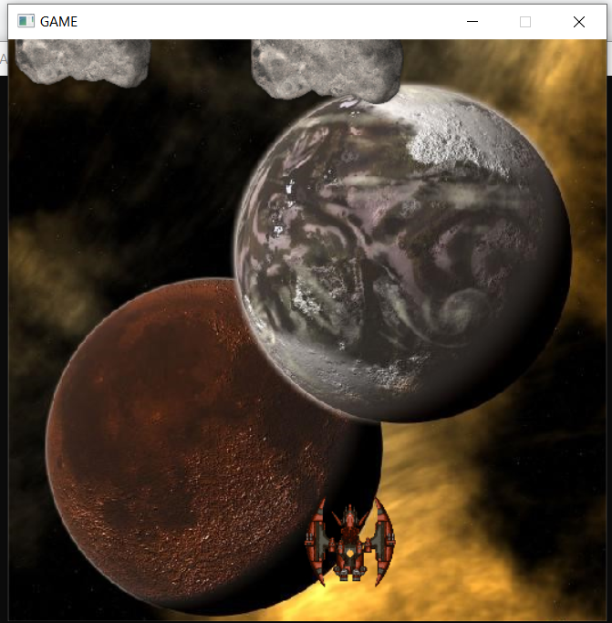

# Jogo de Asteroides
Projeto realizado para a disciplina de Algoritmos e Prgramação II, usando a biblioteca SDL2 para C++, que permite a criação de interfaces gráficas.
Neste trabalho, foi desenvolvido um jogo, similar ao clássico Asteroides, usando a SDL2 e C++.
Os assets são de domínio público.

Imagem:

